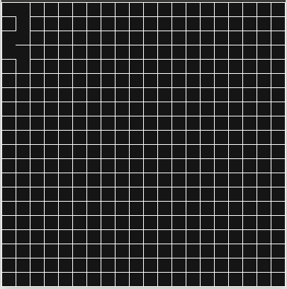
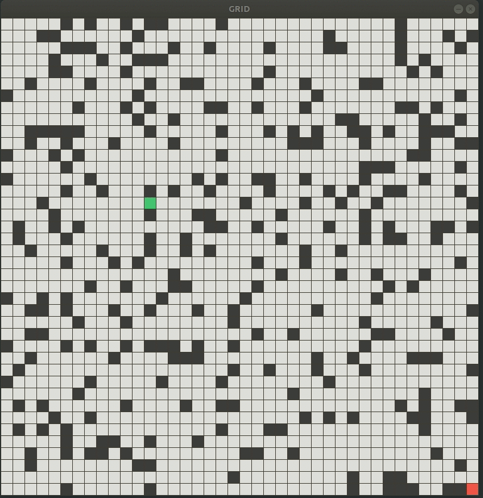
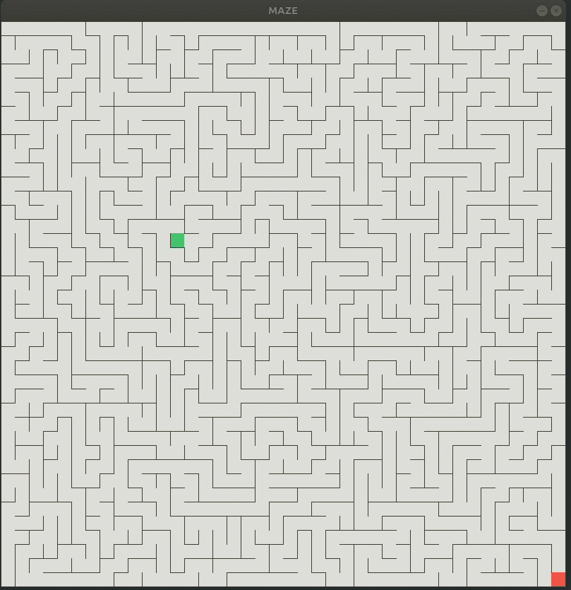

# Motley
This repository is made for the sole purpose of doing random assortment of projects that might not be cohesive. This is intended to take away any commitment issues and just take joy in the process of coding. The projects / codes found in this repositories can range from just simple studies of existing projects spread across the internet to full applications developed from scratch. 

# Maze generation

## Randomized depth search (Rendered using SDL)


## Path finding tool



### Sample usage
```cpp
#include "Visualization.h"
#include "PathFinding.h"

namespace PF = pathfinding;

int main(int argc, char** argv) {    
    // Number of rows in the grid
    uint32_t rows{40};

    // Number of cols in the grid
    uint32_t cols{40};

    // Size of individual cell in pixels
    uint32_t cell_size{20};

    // Choose a starting point
    PF::Cell start(3, 3);

    // Choose an ending point
    PF::Cell end(30, 19);

    std::unique_ptr<PF::PathFinder> grid_path_finder(new PF::PathFinder(
        PF::EnvironmentType::GRID, PF::PathFindingMethod::BFS,
        PF::ObstacleGenerationMethod::FISHER_YATES_SHUFFLE,
        /**obstacle percentage**/ 0.1, rows, cols, cell_size, start, end,
        true));


    grid_path_finder->showFinalPath();

    // Create a maze PathFinder Object
    std::unique_ptr<PF::PathFinder> maze_path_finder(new PF::PathFinder(
        PF::EnvironmentType::MAZE, PF::PathFindingMethod::DIJKSTRA,
        PF::MazeGenerationMethod::RANDOMIZED_DFS, rows, cols, cell_size, start,
        end, true));

    maze_path_finder->showFinalPath();

    return 0;
}
```


